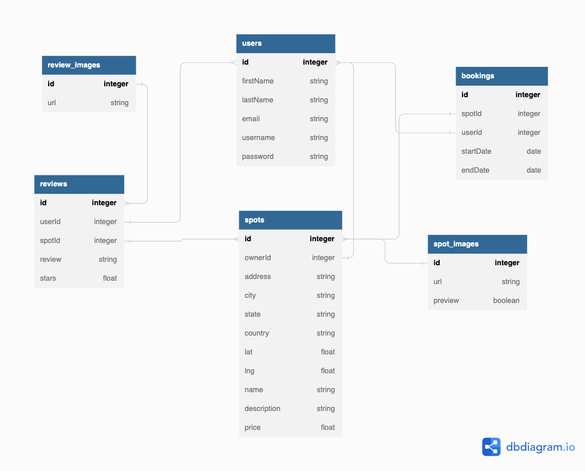

# AirBnB Clone

## Database Schema Design


## API Documentation

## USER AUTHENTICATION/AUTHORIZATION

### All endpoints that require authentication

All endpoints that require a current user to be logged in

* Request
* Response (Error):
  * Status Code: 401
  * Headers: 
      * Content-Type: application/json
  * Body

      ```json
      {
         "message": "Authentication required",
         "statusCode": 401
      }
      ```

### All endpoints that require proper authorization

All endpoints that require authentication and the current user does not have the correct role(s) or permissions(s)

* Request
* Response (Error)
   * Status Code: 403
   * Headers:
     * Content-Type: application/json
   * Body:

     ```json
     {
        "message": "Forbidden",
        "statusCode": 403
     }
     ```

### Get the Current User

Returns the information about the current user that is logged in 

* Require Authentication: true
* Request
  * Method: GET
  * URL: /users/:username
  * Body: none

* Response
  * Status Code: 200
  * Headers:
    * Content-Type: application/json
  * Body:

    ```json
    {
        "id": 1,
        "firstName": "John",
        "lastName": "Smith",
        "email": "john.smith@gmail.com",
        "username": "JohnSmith"
    }
    ```

### Log In a User

Logs in a current user with valid credentials and returns the current user's information

* Require Authentication: false
* Request
  * Method: POST
  * URL:  /users/login || /login
  * Headers:
    * Content-Type: application/json
  * Body:

    ```json
    {
        "credential": "john.smith@gmail.com",
        "password": "secret password"
    }
    ```

* Response
  * Status Code: 200
  * Headers:
    * Content-Type: application/json
  * Body:

    ```json
    {
        "id": 1,
        "firstName": "John",
        "lastName": "Smith",
        "email": "john.smith@gmail.com",
        "username": "JohnSmith",
        "token": ""
    }
    ```

* Response (Invalid credentials)
  * Status Code: 401
  * Headers:
    * Content-Type: application/json
  * Body:

    ```json
    {
        "message": "Invalid credentials",
        "statusCode": 401
    }
    ```

* Response (Body validation errors)
  * Status Code: 400
  * Headers:
    * Content-Type: application/json
  * Body:

    ```json
    {
        "message": "Validation error",
        "statusCode": 400,
        "errors": {
            "credential": "Email or username is required",
            "password": "Password is required"
        }
    }
    ```

### Sign Up a User

Creates a new user, logs them in as the current user, and returns the current user's information

* Require Authentication: false
* Request
  * Method: POST
  * URL: /users/signup
  * Headers:
    * Content-Type: application/json
  * Body:

    ```json
    {
        "firstName": "John",
        "lastName": "Smith",
        "email": "john.smith@gmail.com",
        "username": "JohnSmith",
        "password": "secret password"
    }
    ```

* Response
  * Status Code: 200
  * Headers:
    * Content-Type: application/json
  * Body:

    ```json
    {
        "id": 1,
        "firstName": "John",
        "lastName": "Smith",
        "email": "john.smith@gmail.com",
        "username": "JohnSmith",
        "token": ""
    }
    ```

* Response (User already exists with the specified email)
  * Status Code: 403
  * Headers:
    * Content-Type: application/json
  * Body:

    ```json
    {
        "message": "User already exists",
        "statusCode": 403,
        "errors": {
            "email": "User with that email already exists"
        }
    }
    ```

* Response (User already exists with the specified username)
   * Status Code: 403
   * Headers:
     * Content-Type: application/json
   * Body:

     ```json
     {
        "message": "User already exists",
        "statusCode": 403,
        "errors": {
            "username": "User with that username already exists"
        }
     }
     ```

* Response (Body validation errors)
   * Status Code: 400
   * Headers:
     * Content-Type: application/json
   * Body:

     ```json
     {
        "message": "Validation error",
        "statusCode": 400,
        "errors": {
            "email": "Invalid email",
            "username": "Username is required",
            "firstName": "First Name is required",
            "lastName": "Last Name is required"
        }
     }
     ```

## SPOTS

### Get all Spots

Returns all the spots

* Require Authentication: false
* Request
  * Method: GET
  * URL: /spots
  * Body: none

* Response
  * Status Code: 200
  * Headers:
    * Content-Type: application/json
  * Body:

    ```json
    {
        "Spots": [
            {
                "id": 1,
                "ownerId": 1,
                "address": "123 Disney Lane",
                "city": "San Francisco",
                "state": "California",
                "country": "United States of America",
                "lat": 37.7645358,
                "lng": -122.4730327,
                "name": "App Academy",
                "description": "Place where web developers are created",
                "price": 123,
                "createdAt": "2021-11-19 20:39:36",
                "updatedAt": "2021-11-19 20:39:36",
                "avgRating": 4.5,
                "previewImage": "image url"
            }
        ]
    }
    ```

### Get all spots owned by the current user

Returns all the spots owned (created) by the current user

* Require Authentication: true
* Request
  * Method: GET
  * URL: /users/:username/spots || /spots/:ownerId
  * Body: none

* Response
  * Status Code: 200
  * Headers:
    * Content-Type: application/json
  * Body: 

    ```json
    {
        "Spots": [
            {
                "id": 1,
                "ownerId": 1,
                "address": "123 Disney Lane",
                "city": "San Francisco",
                "state": "California",
                "country": "United States of America",
                "lat": 37.7645358,
                "lng": -122.4730327,
                "name": "App Academy",
                "description": "Place where web developers are created",
                "price": 123,
                "createdAt": "2021-11-19 20:39:36",
                "updatedAt": "2021-11-19 20:39:36",
                "avgRating": 4.5,
                "previewImage": "image url"
            }
        ]
    }
    ```

### Get details of a spot from an id

Returns the details of a spot specified by its id

* Require Authentication: false
* Request
  * Method: GET
  * URL: /spots/:spotId
  * Body: none

* Response
  * Status Code: 200
  * Headers:
    * Content-Type: application/json
  * Body:

    ```json
    {
        "id": 1,
        "ownerId": 1,
        "address": "123 Disney Lane",
        "city": "San Francisco",
        "state": "California",
        "country": "United States of America",
        "lat": 37.7645358,
        "lng": -122.4730327,
        "name": "App Academy",
        "description": "Place where web developers are created",
        "price": 123,
        "createdAt": "2021-11-19 20:39:36",
        "updatedAt": "2021-11-19 20:39:36",
        "numReviews": 5,
        "avgStarRating": 4.5,
        "SpotImages": [
            {
                "id": 1,
                "url": "image url",
                "preview": true
            },
            {
                "id": 2,
                "url": "image url",
                "preview": false
            }
        ],
        "Owner": {
            "id": 1,
            "firstName": "John",
            "lastName": "Smith"
        }
    }
    ```

* Response (Couldn't find a spot with the specified id)
  * Status Code: 404
  * Headers:
    * Content-Type: application/json
  * Body:

    ```json
    {
        "message": "Spot couldn't be found",
        "statusCode": 404
    }
    ```

### Create a spot

Creates and returns a new spot

* Require Authentication: true
* Request
  * Method: POST
  * URL: /users/:username/spots  || /spots
  * Headers:
    * Content-Type: application/json
  * Body:

    ```json
    {
        "address": "123 Disney Lane",
        "city": "San Francisco",
        "state": "California",
        "country": "United States of America",
        "lat": 37.7645358,
        "lng": -122.4730327,
        "name": "App Academy",
        "description": "Place where web developers are created",
        "price": 123
    }
    ```

* Response
  * Status Code: 201
  * Headers:
    * Content-Type: application/json
  * Body:

    ```json
    {
        "id": 1,
        "ownerId": 1,
        "address": "123 Disney Lane",
        "city": "San Francisco",
        "state": "California",
        "country": "United States of America",
        "lat": 37.7645358,
        "lng": -122.4730327,
        "name": "App Academy",
        "description": "Place where web developers are created",
        "price": 123,
        "createdAt": "2021-11-19 20:39:36",
        "updatedAt": "2021-11-19 20:39:36"
    }
    ```

* Response (Body validation error)
  * Status Code: 400
  * Headers:
    * Content-Type: application/json
  * Body:

    ```json
    {
        "message": "Validation Error",
        "statusCode": 400,
        "errors": {
            "address": "Street address is required",
            "city": "City is required",
            "state": "State is required",
            "country": "Country is required",
            "lat": "Latitude is not valid",
            "lng": "Longitude is not valid",
            "name": "Name must be less than 50 characters",
            "description": "Description is required",
            "price": "Price per day is required"
        }
    }
    ```

### Add an image to a spot based on the spot's id

Create and return a new image for a spot specified by id

* Require Authentication: true
* Require proper authorization: spot must belong to the current user
* Request
  * Method: POST
  * URL: /users/:username/spots/:spotId || /spots/:spotId
  * Headers:
    * Content-Type: application/json
  * Body:

    ```json
    {
        "url": "image url",
        "preview": true
    }
    ```

* Response
   * Status Code: 200
   * Headers:
     * Content-Type: application/json
   * Body:

     ```json
     {
        "id": 1,
        "url": "image url",
        "preview": true
     }
     ```

* Response (Couldn't find a spot with the specified id)
  * Status Code: 404
  * Headers:
    * Content-Type: application/json
  * Body:

    ```json
    {
        "message": "Spot couldn't be found",
        "statusCode": 404
    }
    ```

### Edit a spot

Updates and returns an existing spot

* Require Authentication: true
* Require proper authorization: spot must belong to the current user
* Request
  * Method: PUT
  * URL: /users/:username/spots/:spotId  || /spot/:spotId
  * Headers:
    * Content-Type: application/json
  * Body:

    ```json
    {
        "address": "123 Disney Lane",
        "city": "San Francisco",
        "state": "California",
        "country": "United States of America",
        "lat": 37.7645358,
        "lng": -122.4730327,
        "name": "App Academy",
        "description": "Place where web developers are created",
        "price": 123
    }
    ```

* Response
  * Status Code: 200
  * Headers:
    * Content-Type: application/json
  * Body:

    ```json
    {
        "id": 1,
        "ownerId": 1,
        "address": "123 Disney Lane",
        "city": "San Francisco",
        "state": "California",
        "country": "United States of America",
        "lat": 37.7645358,
        "lng": -122.4730327,
        "name": "App Academy",
        "description": "Place where web developers are created",
        "price": 123,
        "createdAt": "2021-11-19 20:39:36",
        "updatedAt": "2021-11-20 10:06:40"
    }
    ```

* Response (Body validation error)
  * Status Code: 400
  * Headers:
    * Content-Type: application/json
  * Body:

    ```json
    {
        "message": "Validation Error",
        "statusCode": 400,
        "errors": {
            "address": "Street address is required",
            "city": "City is required",
            "state": "State is required",
            "country": "Country is required",
            "lat": "Latitude is not valid",
            "lng": "Longitude is not valid",
            "name": "Name must be less than 50 characters",
            "description": "Description is required",
            "price": "Price per day is required"
        }
    }
    ```

* Response (Couldn't find a spot with the specified id)
  * Status Code: 404
  * Headers:
    * Content-Type: application/json
  * Body:

    ```json
    {
        "message": "Spot couldn't be found",
        "statusCode": 404
    }
    ```

### Delete a Spot

Deletes an existing spot

* Require Authentication: true
* Require proper authorization: spot must belong to the current user
* Request
  * Method: DELETE
  * URL: /users/:username/spots/:spotId || /spots/:spotId
  * Body: none

* Response
  * Status Code: 200
  * Headers:
    * Content-Type: application/json
  * Body:

    ```json
    {
        "message": "Successfully deleted",
        "statusCode": 200
    }
    ```

* Response (Couldn't find a spot with the specified id)
  * Status Code: 404
  * Headers:
    * Content-Type: application/json
  * Body:

    ```json
    {
        "message": "Spot couldn't be found",
        "statusCode": 404
    }
    ```

## REVIEWS
 
### Get all reviews of the current user

Returns all the reviews written by the current user

* Require Authentication: true
* Request
  * Method: GET
  * URL: /users/:username/reviews || /reviews/:userId
  * Body: none

* Response
  * Status Code: 200
  * Headers:
    * Content-Type: application/json
  * Body:

    ```json
    {
        "Reviews": [
            {
                "id": 1,
                "userId": 1,
                "spotId": 1,
                "review": "This was an awesome spot!",
                "stars": 5,
                "createdAt": "2021-11-19 20:39:36",
                "updatedAt": "2021-11-19 20:39:36",
                "User": {
                    "id": 1,
                    "firstName": "John",
                    "lastName": "Smith"
                },
                "Spot": {
                    "id": 1,
                    "ownerId": 1,
                    "address": "123 Disney Lane",
                    "city": "San Francisco",
                    "state": "California",
                    "country": "United States of America",
                    "lat": 37.7645358,
                    "lng": -122.4730327,
                    "name": "App Academy",
                    "price": 123,
                    "previewImage": "image url",
                },
                "ReviewImages": [
                    {
                        "id": 1,
                        "url": "image url"
                    }
                ]
            }
        ]
    }
    ```

### Get all reviews by a spot's id

Returns all the reviews that belong to a spot specified by id

* Require Authentication: false
* Request
  * Method: GET
  * URL: /reviews/:spotId
  * Body: none

* Response
  * Status Code: 200
  * Headers:
    * Content-Type: application/json
  * Body:

    ```json
    {
        "Reviews": [
            {
                "id": 1,
                "userId": 1,
                "spotId": 1,
                "review": "This was an awesome spot!",
                "stars": 5,
                "createdAt": "2021-11-19 20:39:36",
                "updatedAt": "2021-11-19 20:39:36",
                "User": {
                    "id": 1,
                    "firstName": "John",
                    "lastName": "Smith"
                },
                "ReviewImages": [
                    {
                        "id": 1,
                        "url": "image url"
                    }
                ]
            }
        ]
    }
    ```

* Response (Couldn't find a spot with the specified id)
  * Status Code: 404
  * Headers:
    * Content-Type: application/json
  * Body:

    ```json
    {
        "message": "Spot couldn't be found",
        "statusCode": 404
    }
    ```

### Create a review for a spot based on the spot's id

Create and return a new review for a spot specified by id

* Require Authentication: true
* Request
  * Method: POST
  * URL: /users/:username/reviews/:spotId || /reviews/:spotId
  * Headers:
    * Content-Type: application/json
  * Body:

  ```json
  {
    "review": "This was an awesome spot!",
    "stars": 5
  }
  ```

* Response
  * Status Code: 201
  * Headers:
    * Content-Type: application/json
  * Body:

    ```json
    {
        "id": 1,
        "userId": 1,
        "spotId": 1,
        "review": "This was an awesome spot!",
        "stars": 5,
        "createdAt": "2021-11-19 20:39:36",
        "updatedAt": "2021-11-19 20:39:36"
    }
    ```

* Response (Body validation errors)
  * Status Code: 400
  * Headers:
    * Content-Type: application/json
  * Body:

    ```json
    {
        "message": "Validation error",
        "statusCode": 400,
        "errors": {
            "review": "Review text is required",
            "stars": "Stars must be an integer from 1 to 5"
        }
    }
    ```

* Response (Couldn't find a spot with specified id)
  * Status Code: 404
  * Headers:
    * Content-Type: application/json
  * Body:

    ```json
    {
        "message": "Spot couldn't be found",
        "statusCode": 404
    }
    ```

* Response (Review from the current user already exists for the Spot)
  * Status Code: 403
  * Headers:
    * Content-Type: application/json
  * Body:

    ```json
    {
        "message": "User already has a review for this spot",
        "statusCode": 403
    }
    ```

### Add an image to a review based on the review's id

Create and return a new image for a review specified by id

* Require Authentication: true
* Require proper authorization: Review must belong to the current user
* Request
  * Method: POST
  * URL: /users/:username/reviews/:reviewId || /reviews/:reviewId
  * Headers:
    * Content-Type: application/json
  * Body:

    ```json
    {
        "url": "image url"
    }
    ```

* Response
  * Status Code: 200
  * Headers:
    * Content-Type: application/json
  * Body:

    ```json
    {
        "id": 1,
        "url": "image url"
    }
    ```

* Response (Couldn't find a review with the specified id)
  * Status Code: 404
  * Headers:
    * Content-Type: application/json
  * Body:

    ```json
    {
        "message": "Review couldn't be found",
        "statusCode": 404
    }
    ```

* Response (Cannot add any more images because there is a maximum of 10 images per resource)
  * Status Code: 403
  * Headers:
    * Content-Type: application/json
  * Body:

    ```json
    {
        "message": "Maximum number of images for this resource was reached",
        "statusCode": 403
    }
    ```

### Edit a review

Update and return an existing review

* Require Authentication: true
* Require proper authorization: Review must belong to the current user
* Request
  * Method: PUT
  * URL: /users/:userId/reviews/:reviewId || /reviews/:reviewId
  * Headers:
    * Content-Type: application/json
  * Body:

    ```json
    {
        "review": "This was an awesome spot!",
        "stars": 5
    }
    ```

* Response
  * Status Code: 200
  * Headers:
    * Content-Type: application/json
  * Body:

    ```json
    {
        "id": 1,
        "userId": 1,
        "spotId": 1,
        "review": "This was an awesome spot!",
        "stars": 5,
        "createdAt": "2021-11-19 20:39:36",
        "updatedAt": "2021-11-20 10:06:40"
    }
    ```

* Response (Body validation errors)
  * Status Code: 400
  * Headers:
    * Content-Type: application/json
  * Body:

    ```json
    {
        "message": "Validation error",
        "statusCode": 400,
        "errors": {
            "review": "Review text is required",
            "stars": "Stars must be an integer from 1 to 5"
        }
    }
    ```

* Response (Couldn't find a review with the specified id)
  * Status Code: 404
  * Headers:
    * Content-Type: application/json
  * Body:

    ```json
    {
        "message": "Review couldn't be found",
        "statusCode": 404
    }
    ```

### Delete a review

Delete an existing review

* Require Authentication: true
* Require proper authorization: Review must belong to the current user
* Request
  * Method: DELETE
  * URL: /users/:userId/review/:reviewId || /review/:reviewId
  * Body: none

* Response
  * Status Code: 200
  * Headers:
    * Content-Type: application/json
  * Body:

    ```json
    {
        "message": "Successfully deleted",
        "statusCode": 200
    }
    ```

* Response (Couldn't find a review with the specified id)
  * Status Code: 404
  * Headers:
    * Content-Type: application/json
  * Body:

    ```json
    {
        "message": "Review couldn't be found",
        "statusCode": 404
    }
    ```

## BOOKING 

### Get all of the current user's bookings

Return all the bookings that the current user has made

* Require Authentication: true
* Request
  * Method: GET
  * URL: /bookings/:userId
  * Body: none

* Response
  * Status Code: 200
  * Headers:
    * Content-Type: application/json
  * Body:

    ```json
    {
        "Bookings": [
            {
                "id": 1,
                "spotId": 1,
                "Spot": {
                    "id": 1,
                    "ownerId": 1,
                    "address": "123 Disney Lane",
                    "city": "San Francisco",
                    "state": "California",
                    "country": "United States of America",
                    "lat": 37.7645358,
                    "lng": -122.4730327,
                    "name": "App Academy",
                    "price": 123,
                    "previewImage": "image url"
                },
                "userId": 2,
                "startDate": "2021-11-19",
                "endDate": "2021-11-20",
                "createdAt": "2021-11-19 20:39:36",
                "updatedAt": "2021-11-19 20:39:36"
            }
        ]
    }
    ```

### Get all bookings for a spot based on the spot's id

Return all the bookings for a spot specified by id

* Require Authentication: true
* Request
  * Method:  GET
  * URL: /bookings/:spotId
  * Body: none

* Response (NOT the owner of the spot)
  * Status Code: 200
  * Headers:
    * Content-Type: application/json
  * Body:

    ```json
    {
        "Bookings" : [
            {
                "spotId": 1,
                "startDate": "2021-11-19",
                "endDate": "2021-11-20"
            }
        ]
    }
    ```

* Response (Owner of the spot)
  * Status Code: 200
  * Headers:
    * Content-Type: application/json
  * Body:

    ```json
    {
        "Bookings": [
            {
                "User": {
                    "id": 2,
                    "firstName": "John",
                    "lastName": "Smith"
                },
                "id": 1,
                "spotId": 1,
                "userId": 2,
                "startDate": "2021-11-19",
                "endDate": "2021-11-20",
                "createdAt": "2021-11-19 20:39:36",
                "updatedAt": "2021-11-19 20:39:36"
            }
        ]
    }
    ```

* Response (Couldn't find a spot with the specified id)
  * Status Code: 404
  * Headers:
    * Content-Type: application/json
  * Body:

    ```json
    {
        "message": "Spot couldn't be found",
        "statusCode": 404
    }
    ```

### Create a booking from a spot based on the spot's id

Create and return a new booking from a spot specified by id

* Require Authentication: true
* Require proper authorization: spot must not belong to the current user
* Request
  * Method: POST
  * URL: /bookings/:spotId
  * Body:

    ```json
    {
        "startDate": "2021-11-19",
        "endDate": "2021-11-20"
    }
    ```

* Response
  * Status Code: 200
  * Headers:
    * Content-Type: application/json
  * Body:

    ```json
    {
        "id": 1,
        "spotId": 1,
        "userId": 2,
        "startDate": "2021-11-19",
        "endDate": "2021-11-20",
        "createdAt": "2021-11-19 20:39:36",
        "updatedAt": "2021-11-19 20:39:36"
    }
    ```

* Response (Body validation errors)
  * Status Code: 400
  * Headers:
    * Content-Type: application/json
  * Body:

    ```json
    {
        "message": "Validation error",
        "statusCode": 400,
        "errors": {
            "endDate": "endDate cannot be on or before startDate"
        }
    }
    ```

* Response (Couldn't find a spot with the specified id)
  * Status Code: 404
  * Headers:
    * Content-Type: application/json
  * Body:

    ```json
    {
        "message": "Spot couldn't be found",
        "statusCode": 404
    }
    ```

* Response (Booking conflict)
  * Status Code: 403
  * Headers:
    * Content-Type: application/json
  * Body:

    ```json
    {
        "message": "Sorry, this spot is already booked for the specified dates",
        "statusCode": 403,
        "errors": {
            "startDate": "Start date conflicts with an existing booking",
            "endDate": "End date conflicts with an existing booking"
        }
    }
    ```

### Edit a Booking

Update and return an existing booking

* Require Authentication: true
* Require proper authorization: Booking must belong to the current user
* Request
  * Method: PUT
  * URL: /bookings/:bookingId
  * Headers:
    * Content-Type: application/json
  * Body:

    ```json
    {
        "startDate": "2021-11-19",
        "endDate": "2021-11-20"
    }
    ```

* Response
  * Status Code: 200
  * Headers:
    * Content-Type: application/json
  * Body:

    ```json
    {
        "id": 1,
        "spotId": 1,
        "userId": 2,
        "startDate": "2021-11-19",
        "endDate": "2021-11-20",
        "createdAt": "2021-11-19 20:39:36",
        "updatedAt": "2021-11-20 10:06:40"
    }
    ```

* Response (Body validation errors)
  * Status Code: 400
  * Headers:
    * Content-Type: application/json
  * Body:

    ```json
    {
        "message": "Validation error",
        "statusCode": 400,
        "errors": {
            "endDate": "endDate cannot come before startDate"
        }
    }
    ```

* Response (Couldn't find a booking with the specified id)
  * Status Code: 404
  * Headers:
    * Content-Type: application/json
  * Body:

    ```json
    {
        "message": "Booking couldn't be found",
        "statusCode": 404
    }
    ```

* Response (Can't edit a booking that's past the end date)
  * Status Code: 403
  * Headers:
    * Content-Type: application/json
  * Body:

    ```json
    {
        "message": "Past bookings can't be modified",
        "statusCode": 403
    }
    ```

* Response (Booking conflict)
  * Status Code: 403
  * Headers:
    * Content-Type: application/json
  * Body:

    ```json
    {
        "message": "Sorry, this spot is already booked for the specified dates",
        "statusCode": 403,
        "errors": {
            "startDate": "Start date conflicts with an existing booking",
            "endDate": "End date conflicts with an existing booking"
        }
    }
    ```

### Delete a booking

Delete an existing booking

* Require Authentication: true
* Require proper authorization: Booking must belong to the current user or the spot must belong to the current user
* Request
  * Method: DELETE
  * URL: /bookings/:bookingId
  * Body: none

* Response
  * Status Code: 200
  * Headers:
    * Content-Type: application/json
  * Body:

    ```json
    {
        "message": "Successfully deleted",
        "statusCode": 200
    }
    ```

* Response (Couldn't find a booking with the specified id)
  * Status Code: 404
  * Headers:
    * Content-Type: application/json
  * Body:

    ```json
    {
        "message": "Booking couldn't be found",
        "statusCode": 404
    }
    ```

* Response (Bookings that have been started can't be deleted)
  * Status Code: 403
  * Headers:
    * Content-Type: application/json
  * Body:

    ```json
    {
        "message": "Bookings that have been started can't be deleted",
        "statusCode": 403
    }
    ```

## IMAGES

### Delete a spot image

Delete an existing image for a Spot

* Require Authentication: true
* Require proper authorization: Spot must belong to the current user
* Request
  * Method: DELETE
  * URL: /spots/spot-images/:id
  * Body: none

* Response
  * Status Code: 200
  * Headers:
    * Content-Type: application/json
  * Body:

    ```json
    {
        "message": "Successfully deleted",
        "statusCode": 200
    }
    ```

* Response
  * Status Code: 404
  * Headers:
    * Content-Type: application/json
  * Body:

    ```json
    {
        "message": "Spot Image couldn't be found",
        "statusCode": 404
    }
    ```

### Delete a review image

Delete an existing image for a review

* Require Authentication: true
* Require proper authorization: review must belong to the current user
* Request
  * Method: DELETE
  * URL: /reviews/review-images/:id
  * Body: none

* Response
  * Status Code: 200
  * Headers:
    * Content-Type: application/json
  * Body:

    ```json
    {
        "message": "Successfully deleted",
        "statusCode": 200
    }
    ```

* Response
  * Status Code: 404
  * Headers:
    * Content-Type: application/json
  * Body:

    ```json
    {
        "message": "Review Image couldn't be found",
        "statusCode": 404
    }
    ```

## Add Query Filters to Get All Spots

Return spots filtered by query parameters.

* Require Authentication: false
* Request
  * Method: GET
  * URL: /spots?page=:page&&size=:size&&minLat=:minLat
  * Query Parameters
    * page: integer, minimum: 0, maximum: 10, default: 0
    * size: integer, minimum: 0, maximum: 20, default: 20
    * minLat: decimal, optional
    * maxLat: decimal, optional
    * minLng: decimal, optional
    * maxLng: decimal, optional
    * minPrice: decimal, optional, minimum: 0
    * maxPrice: decimal, optional, minimum: 0
  * Body: none

* Response
  * Status Code: 200
  * Headers:
    * Content-Type: application/json
  * Body:

    ```json
    {
      "Spots":[
        {
          "id": 1,
          "ownerId": 1,
          "address": "123 Disney Lane",
          "city": "San Francisco",
          "state": "California",
          "country": "United States of America",
          "lat": 37.7645358,
          "lng": -122.4730327,
          "name": "App Academy",
          "description": "Place where web developers are created",
          "price": 123,
          "createdAt": "2021-11-19 20:39:36",
          "updatedAt": "2021-11-19 20:39:36",
          "previewImage": "image url"
        }
      ],
      "page": 2,
      "size": 25
    }
    ```

* Response (Query parameter validation errors)
  * Status Code: 400
  * Headers:
    * Content-Type: application/json
  * Body:

    ```json
    {
      "message": "Validation Error",
      "statusCode": 400,
      "errors": {
        "page": "Page must be greater than or equal to 0",
        "size": "Size must be greater than or equal to 0",
        "maxLat": "Maximum latitude is invalid",
        "minLat": "Minimum latitude is invalid",
        "minLng": "Maximum longitude is invalid",
        "maxLng": "Minimum longitude is invalid",
        "minPrice": "Maximum price must be greater than or equal to 0",
        "maxPrice": "Minimum price must be greater than or equal to 0"
      }
    }
    ```